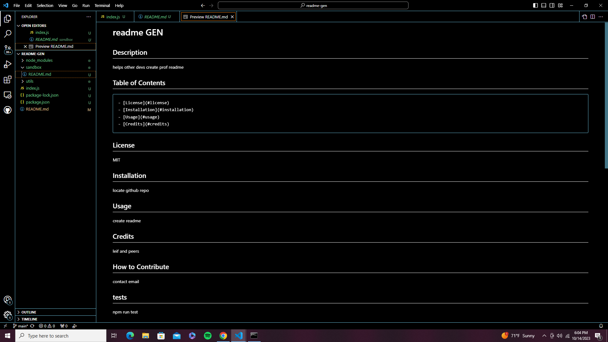

# README-Generator

## Description 
This application can help developers or any user to generate a professional README. 
The user will have to answer a few questions in the command line by running "node index.js" in the terminal. The finish product of the README will include description, table of contents, installation, usage, license, contributing, tests, and questions.

## Assets 

Link to demonstration video: https://youtu.be/lRP4zCn2Bwk

## Contribution 
Kevinserrano0823@gmail.com
